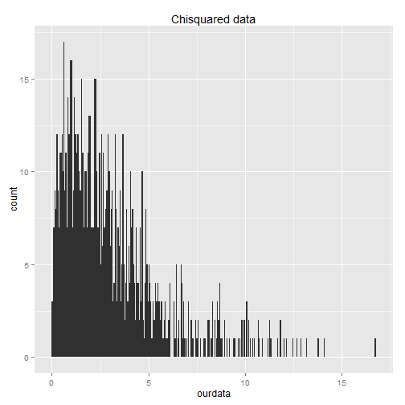

This is our story for Lab 4, STAT 585X Class
====
by Alvarez, Basulto, Erciulescu, Nguyen

This normal curve seems to be fun. It is with us, as statistics students, all the way from introductry course to final 

"agrr, agrrr" said Karl, but no one could understand him, it happens to him since he was a child

Dont Sync All YET!!!

In a world where it was normal not being normal...Gauss was born and things started to change. The Earth all trembeled and the clouds started to move as the there was not enough space in the sky for the sun to show up. But it was not the sun, it was ... Cauchy!!! Hahahaha!

 

Oh, wait a moment! Moments? But there are no moments, time has taken a different dimension. there are birds... and some flowers!!!

we are trying to create a conflict, let's see what happens....hey Yet!

I am creat a conflict

Letsee how I can solve the conflict
