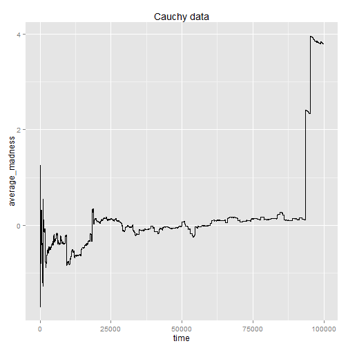

No probles working from GS server, and I didn't make any ssh key or anything
====
This is our story for Lab 4, STAT 585X Class
====
by Alvarez, Basulto, Erciulescu, Nguyen

"Agrr, agrrr!" said Karl, but no one could understand him, it happens to him since he was a child.

In a world where it was normal not being normal...Gauss was born and things started to change. The Earth all trembeled and the clouds started to move as the there was not enough space in the sky for the sun to show up. But it was not the sun, it was ... Cauchy!!! Hahahaha!

 

Oh, wait a moment! Moments? But there are no moments, time has taken a different dimension. There are birds... and some flowers!!!

Everybody was out of control, Fisher couldn't provide his own information. Kolmogorov used claimed that the average madness would be under control in the long run. It wasn't true. 

 

What's going on there? There is no constrain by normality, how things can be converged? At the moment, Khinchin randomly walked in the stage with confidence saying: "no worry, without normality, things are still in its order of nature mother". People are curious looking at him suppiously. Khinchin open his hand, and boom, here we are: "the law of the iterated logarithm".

 

